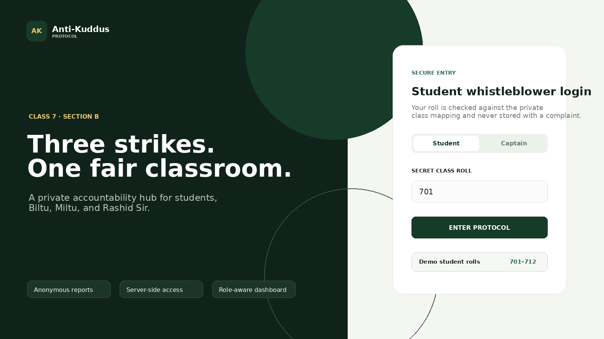
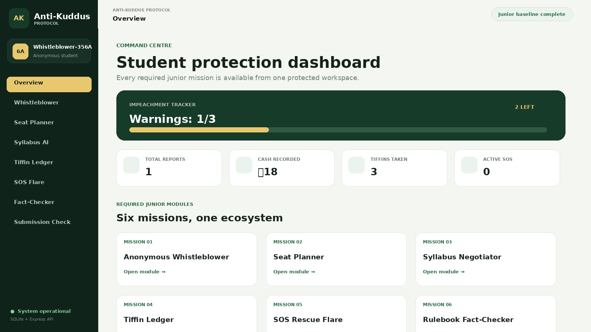
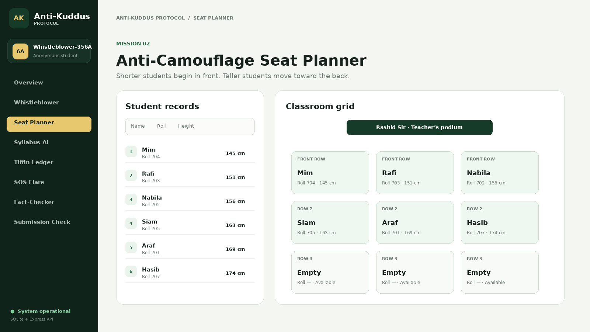

# Anti-Kuddus Protocol

A full-stack junior-segment hackathon project for **BAIUST CSE Spring Fest 2026**. It combines all six required baseline missions into one responsive web application.

## What is included

- **Mission 1 — Anonymous Whistleblower:** secret roll-number login, categorized complaint form, anonymous storage, and dynamic `Warnings: X/3` progress.
- **Mission 2 — Seat Planner:** name/roll/height records, adjustable `N × M` grid, and front-to-back ascending height sort.
- **Mission 3 — Syllabus Negotiator:** server-side Gemini API integration that returns a clean bulleted topic list. A local demo fallback keeps the feature testable without a key.
- **Mission 4 — Corrupt Economy Ledger:** anonymous SQLite records for payments and stolen tiffin, totals, recent entries, and a Chart.js timeline.
- **Mission 5 — SOS Rescue Flare:** mobile-friendly SOS action, hardcoded school location dropdown, and a captain dashboard that refreshes every five seconds.
- **Mission 6 — Fact-Checker:** string and keyword matching against a pre-seeded relational `school_rules` table.
- Role-based student and captain access.
- Responsive UI for desktop and mobile.
- `.env` protection, server-side API key usage, JWT sessions, and basic login throttling.

## Technology

| Layer | Choice |
|---|---|
| Frontend | React 19 + Vite |
| Backend | Node.js + Express |
| Database | Built-in Node SQLite (`node:sqlite`) |
| Charts | Chart.js |
| AI | Google Gemini REST API |
| Authentication | Secret roll mapping + JWT |
| Styling | Custom responsive CSS |

## Folder structure

```text
anti-kuddus-protocol/
├── client/
│   ├── index.html
│   └── src/
│       ├── components/
│       ├── lib/
│       ├── pages/
│       ├── App.jsx
│       ├── main.jsx
│       └── styles.css
├── server/
│   ├── auth.js
│   ├── db.js
│   └── index.js
├── docs/screenshots/
├── .env.example
├── .gitignore
├── package.json
├── vite.config.js
└── README.md
```

## Local setup — Windows / VS Code

### 1. Install Node.js

Install **Node.js 22.5 or newer**. Confirm it in a terminal:

```bash
node -v
npm -v
```

### 2. Open the project

1. Extract the ZIP.
2. Open **VS Code**.
3. Select **File → Open Folder**.
4. Choose the `anti-kuddus-protocol` folder.
5. Open **Terminal → New Terminal**.

### 3. Install packages

```bash
npm install
```

### 4. Create the environment file

Windows Command Prompt:

```bat
copy .env.example .env
```

PowerShell:

```powershell
Copy-Item .env.example .env
```

Open `.env` and replace the development secrets:

```env
PORT=5000
JWT_SECRET=put-a-long-random-secret-here
ROLL_HASH_SECRET=put-a-different-long-random-secret-here
CAPTAIN_CODE=BILTU-MILTU-2026
GEMINI_API_KEY=your-google-ai-studio-key
GEMINI_MODEL=gemini-2.5-flash
```

The app works without `GEMINI_API_KEY`, but Mission 3 then displays the local demo fallback. Add a real key before the final demonstration so the judges see live LLM output.

### 5. Run in development mode

```bash
npm run dev
```

Open:

```text
http://localhost:5173
```

### 6. Production test

```bash
npm run build
npm start
```

Open:

```text
http://localhost:5000
```

## Demo credentials

### Student rolls

Any roll from `701` to `712`.

### Captain access

Use the value configured as `CAPTAIN_CODE` in `.env`.

Default development example:

```text
BILTU-MILTU-2026
```

Change this before deployment.

## Architecture

```text
Browser (React)
      │
      │ JSON + Bearer JWT
      ▼
Express API
      ├── Authentication and authorization
      ├── Complaint / Ledger / SOS / Rule endpoints
      ├── Gemini API call from the server
      └── Input validation
      │
      ▼
SQLite relational database
      ├── students
      ├── complaints
      ├── ledger_entries
      ├── sos_alerts
      └── school_rules
```

## Privacy and security decisions

- Roll numbers are converted to HMAC hashes before database comparison.
- The complaint table has **no roll-number or student foreign-key column**.
- Gemini keys remain server-side in `.env`.
- JWTs expire after eight hours.
- Captain-only endpoints reject student tokens.
- The login endpoint includes a small in-memory attempt limit.
- `.gitignore` excludes `.env`, SQLite database files, build output, and `node_modules`.

## Architectural trade-offs

1. **Polling instead of WebSockets:** The junior requirement only asks for an active captain view. Five-second polling is easier to understand and demonstrate. WebSocket broadcasting belongs to the senior requirement.
2. **Direct string matching instead of embeddings:** Mission 6 uses tokens and exact substring overlap over relational records. This satisfies the junior baseline without adding semantic-search complexity.
3. **SQLite instead of a cloud database:** It provides a real relational database with zero external setup. For large-scale deployment, PostgreSQL would be the next step.
4. **Anonymous complaint rows:** Authentication confirms that a valid student is entering the system, but complaint records remain intentionally unlinked.
5. **Local AI fallback:** The integration code is real and runs when the key is present. The fallback prevents a broken demo when an API quota or network issue occurs.

## Junior requirement matrix

| Requirement | Status | Where to test |
|---|---:|---|
| M1 Roll login | Complete | Login page |
| M1 Complaint form | Complete | Whistleblower |
| M1 Dynamic X/3 bar | Complete | Overview / Whistleblower |
| M2 Student input | Complete | Seat Planner |
| M2 N × M grid | Complete | Seat Planner |
| M2 Height sort | Complete | Seat Planner |
| M3 LLM summarizer | Complete | Syllabus AI |
| M4 Anonymous ledger | Complete | Tiffin Ledger |
| M4 Data chart | Complete | Tiffin Ledger |
| M5 SOS dropdown | Complete | SOS Flare |
| M5 Captain view | Complete | Captain login → Captain Board |
| M6 String matching | Complete | Fact-Checker |
| README documentation | Complete | This file |
| GitHub repository | Team action | Push this folder |
| Video walkthrough | Team action | Record after final testing |

## UI previews

### Secure login



### Student dashboard



### Seat planner



## Recommended demonstration order

1. Log in with roll `701`.
2. Submit a complaint and show the strike bar changing.
3. Add a student and change the seat-grid dimensions.
4. Generate a live AI syllabus summary.
5. Add a payment and a stolen-food entry, then show the chart.
6. Send an SOS from the Corridor.
7. Log out and enter the captain account.
8. Resolve the SOS and review the anonymous complaint feed.
9. Search a fake rule in the Fact-Checker.
10. Open the Submission Check page and show the completed matrix.

## GitHub safety checklist

Before pushing:

```bash
git status
```

Confirm that these files are **not** listed:

```text
.env
server/data/anti-kuddus.db
```

Never copy a Gemini API key into frontend code, screenshots, README, or video.

## Accessibility and mobile upgrades

This version also includes several optional upgrades beyond the junior baseline:

- **Bangla/English language switch:** the complete interface can be changed at any time. The choice is saved in `localStorage`.
- **Light, dark, and system themes:** the selected appearance is remembered on the device.
- **Installable PWA:** the website includes a web-app manifest, icons, a service worker, and a standalone mobile layout. In supported browsers it can be installed like an app.
- **Mobile bottom navigation:** Overview, SOS/Captain Board, and Menu remain reachable with one hand.
- **Offline app shell:** after the app has been opened once, the previously loaded interface can reopen without internet.
- **Offline SOS queue:** when the network is unavailable, the SOS location and time are stored locally and automatically sent after connectivity returns.
- **Offline emergency contacts:** three editable contacts and safety instructions are stored only on the current device and remain available offline.
- **Bangla-aware fact checking and syllabus output:** Bangla claims are mapped to rulebook keywords, and the Gemini prompt requests Bangla output when Bangla mode is selected.

### Install on Android or desktop Chrome

1. Run or deploy the application.
2. Open it in Chrome.
3. Use the in-app **Install app** button when it appears, or open Chrome's menu and choose **Install app** / **Add to Home screen**.
4. Launch it from the home screen or desktop like a normal app.

The browser may only show installation after the manifest, service worker, and icons have loaded. `localhost` is accepted for development; a deployed version should use HTTPS.

### Offline limitations

- Complaint submission, ledger records, AI summarization, live captain data, and server fact checks still need the backend connection.
- SOS is the exception: it is queued on the device while offline and sent later.
- Emergency phone contacts use the device's normal phone dialer and do not require internet.
- Clearing browser storage removes the saved login, language/theme choice, emergency contacts, and any unsent SOS queue.
